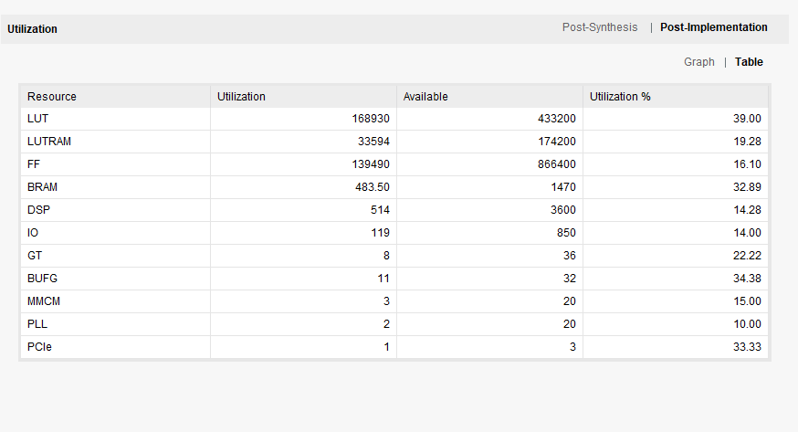
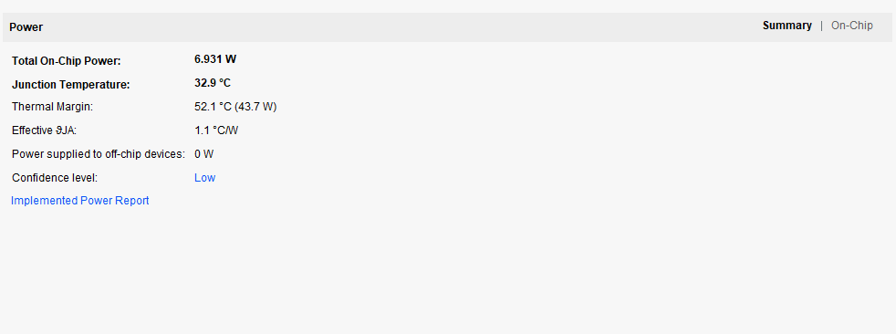
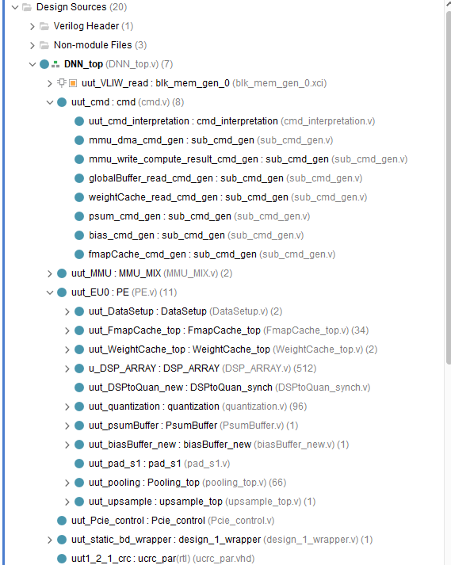

## Introduction
Single-core accelerator on YOLOv3-Tiny.

top.v: IO Interface Information.

top.edf: netlist interface information.
## Environment
Xilinx VC709 FPGA. The EDA tool is Vivado 2018.3, and the simulation tool is ModelSim 10.6d.
## Resource utilization

## Power consumption

## Design Sources

